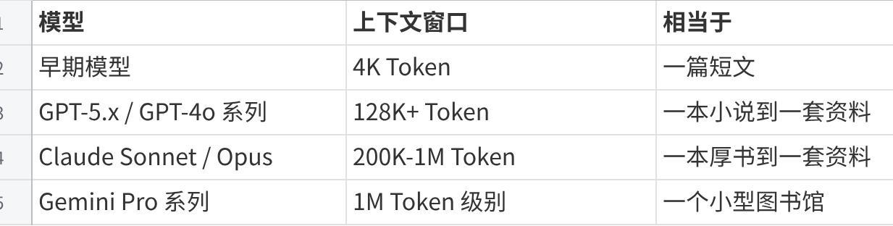
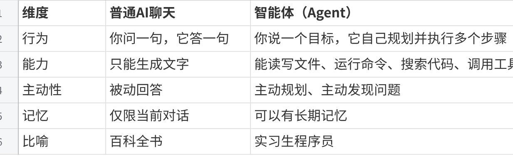
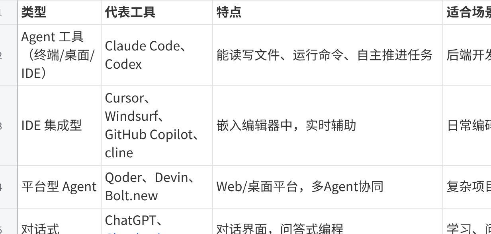
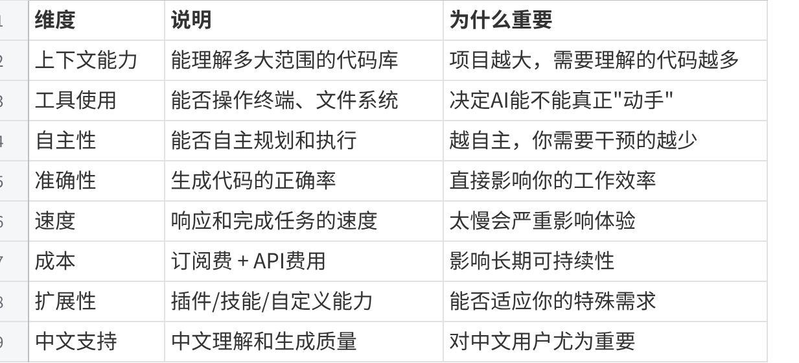
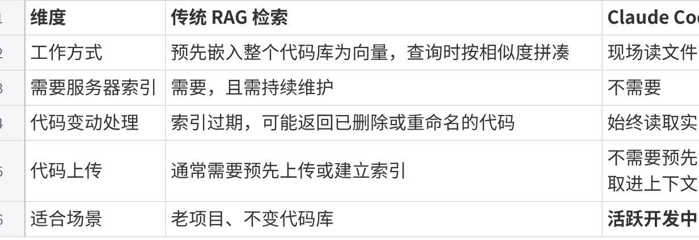
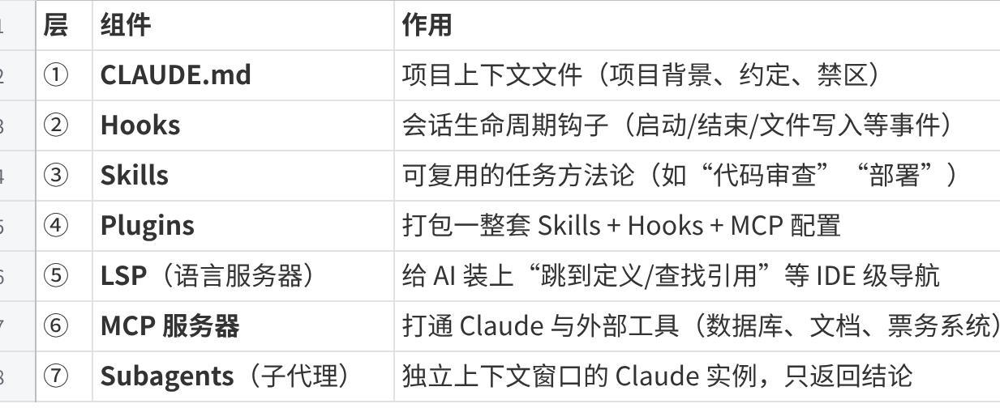
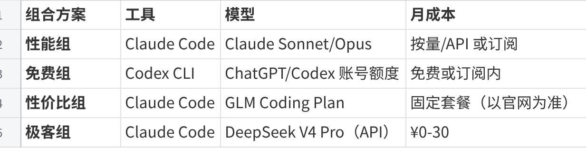
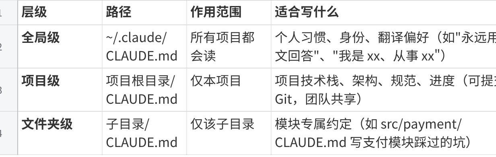

**Claude Code+Codex+Cursor：AI组合学习**

**\[尚硅谷AI Coding教程.md\]**

**命令行：（H1）**

**powershell：（H2）**

**powershell的打开方式：（H3）**

1、win+R，输入powershell

2、特定文件夹目录下，shift+右键，找到在当前位置打开powershell

3、特定文件夹目录下，在文件路径上输入powershell直接打开当前位置的powershell

**powershell和cmd的区别：**

cmd是Windows原生态命令行，powershell是Windows下适配Linux操作的命令行

**命令行基础：**

cd：进入某个目录

mkdir：创建新文件夹

clear：清屏

**AI基础理论介绍：**

**token：**

**什么是token：**

在AI大模型场景下，是文字最小处理单元，主要用于计算文本长度、计费、上下文限制

**token的花费换算：**

1 个 Token ≈ 4 个英文字符 ≈ 1-2 个中文字符。一篇 1000 字的中文文章大约是 500-1000 个 Token。

**Token 计费：你的"油费"**

使用AI模型就像开车需要加油 —— Token 就是你的"油"，用多少付多少。

费用 = 输入Token数 × 输入单价 + 输出Token数 × 输出单价

**上下文窗口：**

**什么是上下文窗口：**

上下文窗口是AI一次能"记住"的内容量。这就像你的办公桌大小 —— 桌子越大，能同时摊开的文件越多。

**点击图片可查看完整电子表格**

对AI编程来说，上下文窗口直接决定了AI能"看到"你项目中多少代码。窗口越大，AI对项目的理解越全面，生成的代码越准确。

**为什么AI有时会"胡说八道"：（AI本质就是算命）**

AI生成内容的本质是**预测概率最高的下一个词**。大多数时候它预测得很准，但有时候它会"一本正经地胡说八道" —— 这被称为**"幻觉"（Hallucination）**。

例如，AI可能信心满满地告诉你某个函数的用法，但这个函数根本不存在。这就像一个知识渊博但偶尔会编故事的朋友 —— 大部分时候值得信赖，但关键信息你需要自己验证。

**避坑**：永远不要100%信任AI生成的代码。尤其是涉及数据库操作、用户认证、支付逻辑等关键代码时，一定要仔细检查。"信任但验证"是AI编程的黄金法则。

**Vibe Coding：**

**什么是Vibe Coding:**

不要纠结代码的每一个细节，跟着感觉走，让AI帮你实现想法。

**Vibe Coding 的核心原则：**

**意图优先**：先描述你想要什么效果，而不是告诉AI怎么写代码

**快速迭代**：不追求一次完美，拥抱"生成 → 测试 → 修正"的循环

**信任但验证**：相信AI的能力，但始终检查关键逻辑

**上下文经营**：持续维护和优化提供给AI的背景信息

**Vibe Coding 适用场景：**

原型开发、概念验证（快速把想法变成可运行的东西）

个人项目、学习项目（试错成本低）

探索性编程（不确定最终效果，边做边看）

UI/前端开发（可视化反馈快，容易判断好不好）

**Vibe Coding 需谨慎的场景：**

注意： 生产环境的核心系统（银行、医疗等）

注意： 安全敏感代码（认证、加密等）

注意： 性能极致要求的场景

**Agentic Engineering（工程化升级范式，多个agent协同工作）：**

**为什么纯 Vibe Coding 在大项目中不够用：**

**代码质量不可控**：AI可能写出能跑但很乱的代码，积累成"技术债务"

**前后矛盾**：AI在不同对话中可能给出相互冲突的实现方式

**缺乏全局视角**：AI可能只关注当前的小任务，忽略对整体架构的影响

**难以协作**：没有统一规范时，多个人（或多次会话）的代码风格各异

这就像建房子 —— 自己搭一个小木屋可以随意发挥（Vibe Coding），但要建一栋大楼就必须有图纸、有规范、有质检（Agentic Engineering）。

**什么是智能体：**

**智能体（Agent）**是一个能够**自主完成任务**的AI系统。

**点击图片可查看完整电子表格**

智能体的工作循环： **感知 → 推理 → 行动 → 反馈**

**智能体协作模式（大型项目使用，一般项目一个单智能体工具就能实现）：**

**领导者-执行者模式（Leader-Worker）：**

一个"老板"Agent负责拆分任务和协调，多个"员工"Agent负责执行具体任务。

**管道式协作（Pipeline）：**

Agent按顺序接力，就像工厂流水线：需求分析Agent → 架构设计Agent → 代码实现Agent → 测试Agent → 部署Agent。

**对等协作（Peer-to-Peer）：**

多个Agent平等地互相审查，就像同事之间互相Code Review。

**自主决策与任务分解：**

**Plan-Act-Observe-Reflect 循环：（一步步往下走）**

Plan（规划）： "要完成登录功能，我需要做这些事......"

Act（行动）： "先创建数据库用户表......"

Observe（观察）："创建成功了，但发现少了一个字段......"

Reflect（反思）："我需要修改表结构，加上邮箱字段......"

回到 Plan： "好的，现在继续下一步......"

**任务分解原则 —— MECE：（多线程同时进行）**

举个例子，把"构建一个博客系统"分解为：

<table style="width:88%;">
<colgroup>
<col style="width: 88%" />
</colgroup>
<tbody>
<tr>
<td style="text-align: left;">Plain Text 
构建博客系统 
├── 1. 用户系统（注册、登录、个人资料） 
├── 2. 文章系统（创建、编辑、删除、列表） 
├── 3. 评论系统（发表、删除、回复） 
├── 4. 分类标签（创建分类、打标签、按分类筛选） 
└── 5. 部署上线（打包、配置服务器、域名）</td>
</tr>
</tbody>
</table>

**提示**：在使用 Claude Code 时，最佳实践是**先让AI制定计划，你确认后再执行**。而不是一上来就让它开始写代码。这个习惯会大幅减少返工。

**Specification-Driven Development（规范驱动开发 SDD）：**

**为什么AI编程需要"规范"：**

**规范（Specification）就是你和AI之间的"合同"**，它明确地写清楚：要做什么（功能需求） 、怎么做（技术方案）、做到什么程度（质量标准），有了这份"合同"，AI才能精准地理解你的意图。

**需求规范：PRD文档：**

**PRD（Product Requirements Document，产品需求文档）**描述的是"要做什么"。

**主要有：用户故事（User Story）格式、验收标准（Acceptance Criteria）格式、用AI辅助生成PRD的Prompt**

**技术规范：SPEC文档：**

**SPEC（Technical Specification，技术规范文档）**描述的是"怎么做"。

**质量规范：**

质量规范定义了"做到什么程度算合格"：**编码规范**：代码风格统一、命名规则、注释要求；**测试规范**：需要覆盖哪些测试场景；**安全规范**：输入验证、认证授权、数据保护。

**规范文件的组织与管理：**

建议在项目根目录下创建一个 specs/ 文件夹，统一管理规范文件：

<table style="width:88%;">
<colgroup>
<col style="width: 88%" />
</colgroup>
<tbody>
<tr>
<td style="text-align: left;">Plain Text 
my-project/ 
├── specs/ 
│ ├── PRD.md # 产品需求文档 
│ ├── SPEC.md # 技术规范 
│ ├── ARCHITECTURE.md # 架构设计 
│ └── API.md # API 接口文档 
├── src/ # 源代码 
├── CLAUDE.md # 给Claude Code的项目说明（详见第二部分） 
└── package.json</td>
</tr>
</tbody>
</table>

规范文件最大的价值之一是 —— **可以直接作为AI工具的上下文输入**。当你把 SPEC.md 的内容提供给 Claude Code 时，它就能精准地按照你的技术方案来写代码。

**主流模型系列介绍：**

**Claude**：**代码生成与指令遵循业界领先**，安全性高，支持超长上下文。

**GPT**：**多模态与工具生态最成熟**，适合UI转代码等视觉理解场景。

**GLM**：**中文与代码能力均衡**，国内直连，配套 CodeGeex 代码助手。

**DeepSeek**：**极致性价比**，代码能力接近 Claude Sonnet，国内直连注册简单。

**通义千问**：**中文理解出色**，国内直连，深度集成阿里云生态。

**参数量：模型的"大脑"大小**

你可能听说过"7B模型"、"70B模型"这样的说法。这里的 B 是 Billion（十亿）的缩写，指的是模型的参数数量。简单理解：参数越多，模型越"聪明"，但也越慢、越贵。

**提示**：参数量不是唯一标准。训练数据的质量、训练方法的优化同样重要。有些小参数模型经过精细调优后，在特定任务上可以媲美大模型。

**Temperature：AI的"创造性开关"**

Temperature 是一个 0-1 之间的参数，控制AI回复的"随机性"：

**Temperature = 0**：每次给出几乎相同的答案（最确定性）→ 适合代码生成

**Temperature = 1**：每次答案都不同（最随机）→ 适合创意写作

**提示**：编写代码时，通常不需要手动调整 Temperature。Claude Code 默认使用适合编程的低 Temperature 值。

**模型选型实战指南：**

<table style="width:88%;">
<colgroup>
<col style="width: 88%" />
</colgroup>
<tbody>
<tr>
<td style="text-align: left;">Plain Text 
你的任务是什么？ 
│ 
├── 简单任务（代码补全、格式化、小修改） 
│ ├── 追求最快速度 → Claude Haiku / GLM-4.5-Air / 本地 Qwen 
│ ├── 追求最低成本 → DeepSeek API / 本地 Ollama 
│ └── 完全免费 → 本地 Ollama 模型 
│ 
├── 日常开发（功能实现、Bug修复、代码生成） 
│ ├── 英文项目 → Claude Sonnet （首选） 
│ ├── 中文项目 → Claude Sonnet 或 通义千问 / GLM-4.7 
│ └── 预算紧张 → DeepSeek V4 / GLM / Kimi 
│ 
├── 复杂任务（架构设计、算法难题、疑难Bug） 
│ ├── 深度推理 → Claude Opus / GPT-5.5 / DeepSeek V4 Pro 
│ └── 超长代码库 → Gemini Pro (1M上下文) 
│ 
└── 特殊场景 
├── 离线/隐私要求 → 本地 Ollama + Llama/Qwen 
├── 截图→代码 → GPT-5.5 / GPT-4o 系列（多模态） 
└── 国内直连要求 → DeepSeek / 千问 / GLM</td>
</tr>
</tbody>
</table>

**AI编程工具生态：**

**AI交互模式分类：**

**点击图片可查看完整电子表格**

**AI能力层级分类：**

<table style="width:88%;">
<colgroup>
<col style="width: 88%" />
</colgroup>
<tbody>
<tr>
<td style="text-align: left;">Plain Text 
L5 自主工程 ─── 端到端自主完成项目（探索中） 
↑ 
L4 项目管理 ─── 多Agent协同、任务分解（Qoder） 
↑ 
L3 任务执行 ─── 自主修改文件、运行命令（Claude Code、Cursor Agent）我们重点学这个 
↑ 
L2 代码生成 ─── 生成完整代码块（ChatGPT、Claude.ai） 
↑ 
L1 代码补全 ─── 行级/函数级补全（Copilot、TabNine）</td>
</tr>
</tbody>
</table>

**AI能力评估参考：**

**点击图片可查看完整电子表格**

**Claude Code：**

如果把AI编程工具比作不同的交通工具：

ChatGPT/Claude.ai 就像**公交车** —— 你问路，它告诉你怎么走，但你得自己走

Cursor 就像**共享单车** —— 你骑着它走，它帮你指路和加速

Claude Code 就像**出租车** —— 你说目的地，它自己开到

**LLM Loop（大模型循环）：**

**对话式 AI（ChatGPT/Claude.ai）的工作方式**：你问一句 → 它答一句 → 结束。如果答案不满意，你再问一次。**主动权一直在你手里**，AI 只是个"高级回答机器"。

**Claude Code 的工作方式**：你下达一个目标 → cc 自己拆解步骤 → 自己调用工具 → 看结果 → 决定下一步 → 再调用工具 → ……一直循环到任务完成。**主动权交给了 AI**。这个不断"思考-行动-观察-再思考"的循环，就叫 **LLM Loop**。

对话式AI至少还有人去参与，但LLM就完全交给AI去判断决策。

**Claude Code 是如何“读懂”你的代码库的（Agentic Search）：**

官方把这种机制叫做 **Agentic Search（智能体式检索）**，它的工作方式和**一个人类工程师冷启动一个项目完全一样。与传统 RAG/向量检索的本质区别：**

**点击图片可查看完整电子表格**

这意味着 Claude Code **天生适合活跃代码库**——它不依赖一份可能过期的预建索引，也不需要 IT 部门部署向量数据库。但它读取到的相关文件内容仍会作为上下文发送给模型服务，所以处理敏感代码时依然要遵守公司安全规范。

**“脚手架”比“模型”更重要：Harness 体系**

**决定 Claude Code 表现的，不只是背后的模型，还有围绕模型搭建的“脚手架 Harness”。**

**点击图片可查看完整电子表格**

**工具+模型组合推荐：**

**点击图片可查看完整电子表格**

**Claude code的正确使用：**

**它怎么把文件改坏了？** → 你得学会管住它

**用着用着怎么变笨了？** → 你得学会管理上下文

**它对每个人都一样，怎么让它懂我？** → 你得学会个性化配置

**claude code的7层扩展：**

**CLAUDE.md** — 项目说明书，每次会话自动加载

**Hooks** — 事件触发器，在特定时机自动执行

**Skills** — 专业知识包，AI 按需加载

**Plugins** — 把 Skills + Hooks + MCP 打包分发

**LSP** — 给 AI 装上 IDE 级的代码导航

**MCP** — 连接外部工具和数据源

**子 Agent** — 独立上下文并行干活

前 3 层是基础配置，后 4 层是高级扩展。**模型能力是地板，配置质量才是天花板**。花时间把配置做好，比追最新模型版本更有实际收益。

**模式选择（对应deepseek）：**

Haiku ≈ Flash（速度性价比款）

Sonnet ≈ Pro（均衡高性能）

Opus ≈ Pro（天花板旗舰）

**settings.json：配置文件**

Claude Code 的配置文件位于 ~/.claude/settings.json。

**为什么claude要用settings.json文档，为什么格式是json**

用settings.json：图形界面只是可视化入口，高级模型映射参数只能手动写 JSON；支持全局 / 项目分层、团队同步、复杂嵌套配置；

选 JSON 格式：全语言通用、类型严格无歧义、和 AI 接口数据格式统一、轻量简洁，适配编辑器插件开发生态。

**CLAUDE.md：你的项目"说明书"**

CLAUDE.md 是 Claude Code 中**最重要的配置文件之一**。它就像你给新来的实习生写的"项目入职手册" —— 告诉AI这个项目的背景、技术栈、编码规范和当前进度。

**CLAUDE.md 的三个层级：**

**点击图片可查看完整电子表格**

三层叠加生效，不冲突。优先级：文件夹级 \> 项目级 \> 全局级。（从里到外）

**Superpowers 插件**

Superpowers 本质是一套**工作方法论集合**，通常会封装成多个可复用 Skill。安装后，AI 可以在合适的任务中调用这些方法论。

想当于skill的合集，里面包含多位大佬总结的一套api用于规范执行工作任务，同一套方法论，而不是AI自己摸索生成出来。
